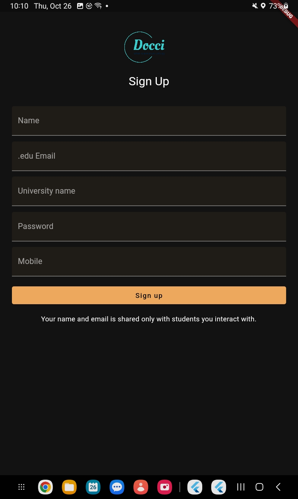
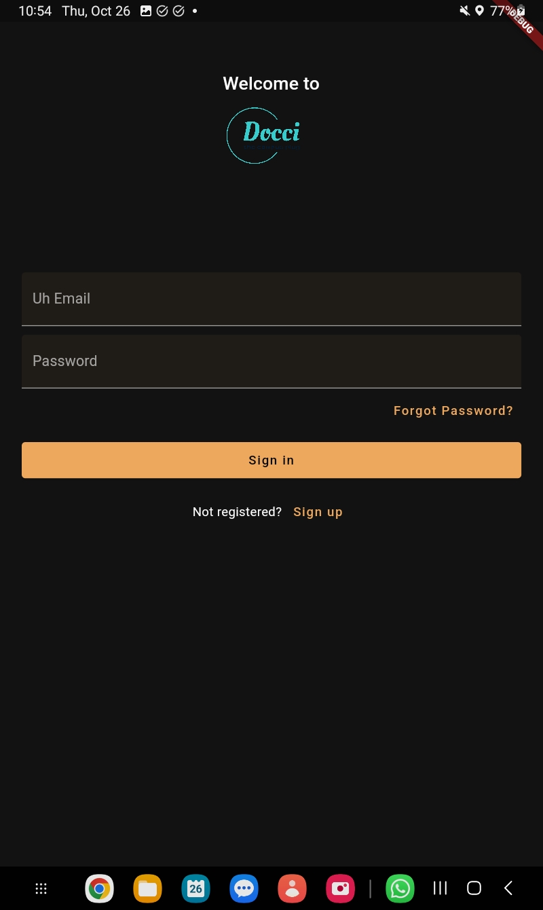
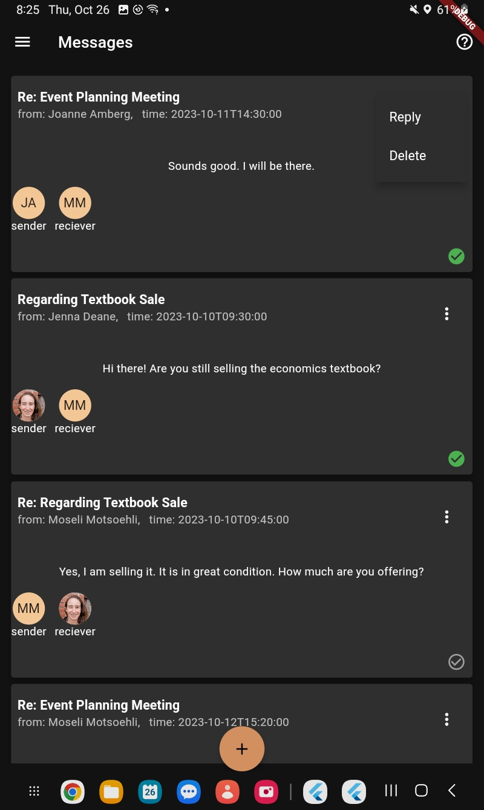
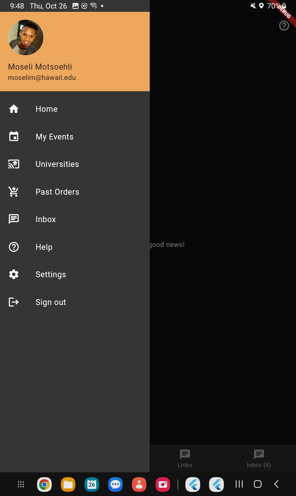
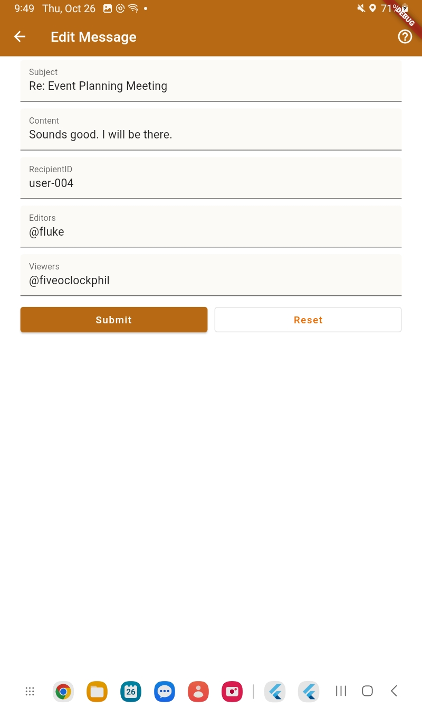

# Docci - localized information and resource hub on colleges

## Table of contents

* [Motivation](#motivation)
* [Approach](#goals)
* [Usage](#usage)
* [Installation](#installation)
* [Development Status](#development-status)
* [About us](#about-us)

## Motivation

The aim of this project is to address the problem of scattered college living information and disconnected student communities by creating a hub for college students to share resources, event information, and ideas. This platform will allow students to create accounts using their university email, share details about social, sporting, and career events on and around campus, and interact with local businesses' event advertisements. Students can also share their extra meal swipes, post items for sale, and access aggregated social media links from various university entities. This solution seeks to enhance the college experience by fostering a more interconnected and resource-sharing community for students at the University of Hawaii.

## Approach

Creating a hub that allows college students to share ideas, event information, and resources such as extra food, extra meal swipes, and books with fellow students in their college.

### Students will be able to

- Create accounts using their UH email, and share information about social, sporting, or career events happening in and around campus
- local businesses will be allowed to advertise events students are likely to be interested in. Students have the option to disable seeing ads
- Share their extra meal swipes at the cafeteria with other students for money or donate to another student. The app will not facilitate the actual transactions.
- Post items they are looking to sell and be able to chat with potential student buyers. The app will however not facilitate the actual transactions.
- See aggregated social media links of the different university bodies such as the gym, sporting facilities, admissions office, the different restaurants on campus, and so on. These normally sit in different parts of the web, making information hard to find.

### Why mobile:

A mobile app allows students to access the platform conveniently from anywhere, and enjoy the benefits of push notifications that alert them of events they might be interested in.

## Usage

### Splash, Sign in, sign pp

  
&nbsp; &nbsp; 
 
&nbsp; &nbsp; 
  

### Home: inbox, drawer, edit message,

  
&nbsp; &nbsp; 
 
&nbsp; &nbsp; 
  
  &nbsp; &nbsp; 
  

### Events page, Marketplace, Campus Links

  
&nbsp; &nbsp; 
 
&nbsp; &nbsp; 
 

### Sell Item, Camera, upload from file
 

## Installation

## Development Status

Project Board: [https://github.com/orgs/Docci-io/projects/1/views/1](https://github.com/orgs/Docci-io/projects/1/views/1)

## About Us

***Moseli Mots'oehi:*** 

PhD student in Computer Science at the University of Hawaii at Manoa.

Email: [moselim@hawaii.edu](mailto:moselim@hawaii.edu)

Portfolio: [https://deepsmoseli.github.io/](https://deepsmoseli.github.io/)
